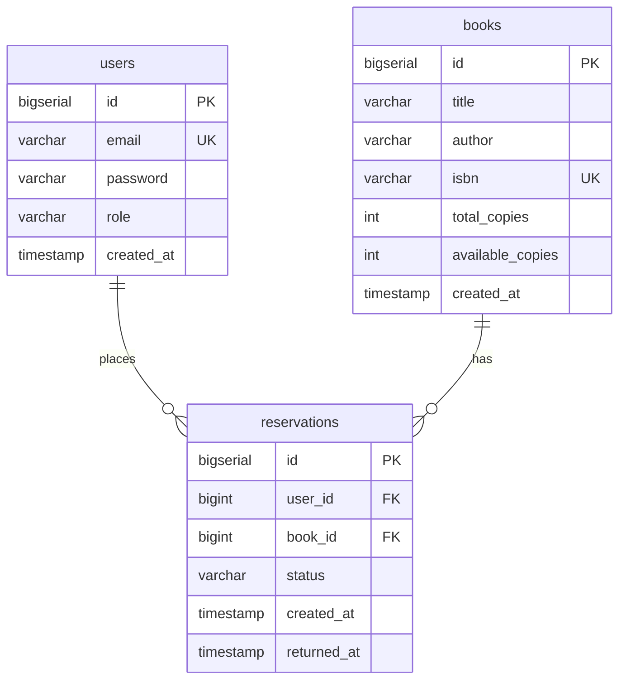

# Diagram ERD — Bookstore

## Relacje

- **users → reservations** — jeden użytkownik może mieć wiele rezerwacji
- **books → reservations** — jedna książka może mieć wiele rezerwacji

## Enumy

| Tabela | Pole | Wartości |
|--------|------|----------|
| `users` | `role` | `USER`, `ADMIN` |
| `reservations` | `status` | `PENDING`, `ACTIVE`, `RETURNED`, `CANCELLED` |
